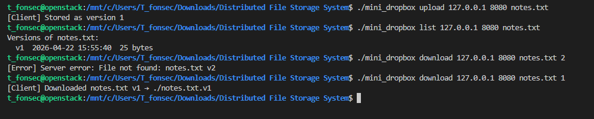
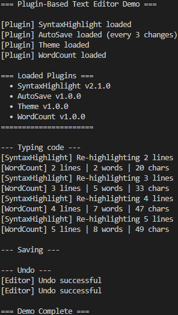
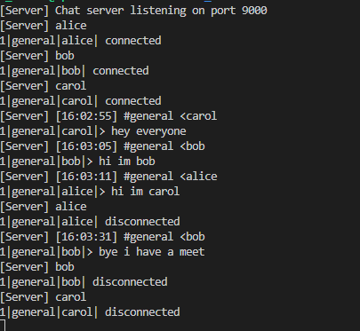
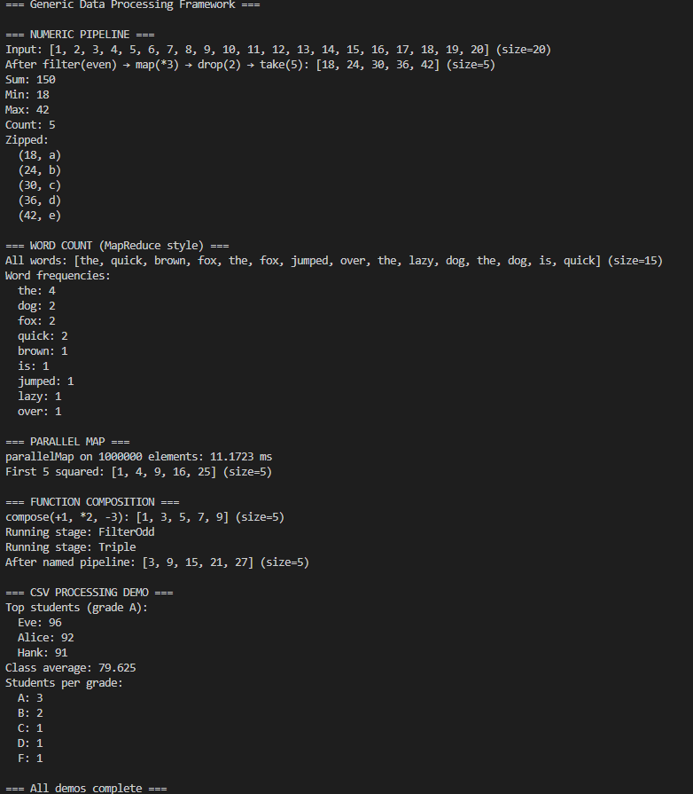

<div align="center">

```
██████╗ ███████╗███████╗    ███████╗██╗   ██╗███████╗████████╗███████╗███╗   ███╗███████╗
██╔══██╗██╔════╝██╔════╝    ██╔════╝╚██╗ ██╔╝██╔════╝╚══██╔══╝██╔════╝████╗ ████║██╔════╝
██║  ██║█████╗  ███████╗    ███████╗ ╚████╔╝ ███████╗   ██║   █████╗  ██╔████╔██║███████╗
██║  ██║██╔══╝  ╚════██║    ╚════██║  ╚██╔╝  ╚════██║   ██║   ██╔══╝  ██║╚██╔╝██║╚════██║
██████╔╝██║     ███████║    ███████║   ██║   ███████║   ██║   ███████╗██║ ╚═╝ ██║███████║
╚═════╝ ╚═╝     ╚══════╝    ╚══════╝   ╚═╝   ╚══════╝   ╚═╝   ╚══════╝╚═╝     ╚═╝╚══════╝
```

### **Four C++17 Systems to help understand CPP better**

[](https://en.cppreference.com/w/cpp/17)
[](https://gcc.gnu.org/)
[](https://www.linux.org/)
[](LICENSE)
[](.)

</div>

---

## 🗂️ What's In Here

Four complete, single-file C++17 systems; each one a different architectural style, each one covering a different slice of the language.All concepts explained inline with `[TAGGED]` comments.

```
📦 Distributed File Storage System/
├── 🗄️  mini_dropbox.cpp      ← TCP file server with versioning
├── 🖊️  plugin_editor.cpp     ← VS Code-like plugin architecture
├── 💬  chat_server.cpp       ← Real-time multi-user chat backend
├── ⚡  data_pipeline.cpp     ← Generic Spark-like data engine
├── 📖  cpp_projects_guide.docx
├── 📁  images/               ← Screenshots (below)
└── 📝  notes.txt
```

---

##  Build All (one-liner)

```bash
g++ -std=c++17 -pthread -O2 -o mini_dropbox  mini_dropbox.cpp
g++ -std=c++17 -pthread -O2 -o chat_server   chat_server.cpp
g++ -std=c++17           -O2 -o plugin_editor plugin_editor.cpp
g++ -std=c++17 -pthread  -O2 -o data_pipeline data_pipeline.cpp
```

> **Requirements:** GCC 9+ or Clang 10+, POSIX-compatible OS (Linux, macOS, WSL2)

---

<br>

## 📦 Project 1 : Mini Dropbox
### *Modular Distributed File Storage System*

> A TCP client-server file store with versioning. Upload, download, and retrieve any historical version of any file : think Dropbox, built from raw sockets and smart pointers.

### Run it

```bash
# Terminal 1 — start server
./mini_dropbox server 8080 disk ./storage

# Terminal 2 — upload, list, download
./mini_dropbox upload   127.0.0.1 8080 notes.txt
./mini_dropbox list     127.0.0.1 8080 notes.txt
./mini_dropbox download 127.0.0.1 8080 notes.txt 1
```

### Output



> `notes.txt` uploaded as **v1**, version listing shows timestamp + size, download by version number  error handling for missing versions included.

### C++ Concepts Used

| Concept | Where |
|---|---|
| `unique_ptr` / `shared_ptr` | Storage engine ownership; shared across threads |
| **Move semantics** | `FileVersion` move ctor; `std::move` at every transfer |
| **Pure abstract interface** | `IStorageEngine`, `ISerializer` — pure virtual |
| **Factory pattern** | `StorageFactory::create("disk"/"memory")` |
| **Strategy pattern** | Swappable `BinarySerializer` via `ISerializer*` |
| **RAII** | `SocketHandle` wraps raw fd, auto-closes |
| **TCP sockets** | Full POSIX server, length-prefixed wire protocol |
| **`std::thread` + `std::mutex`** | One thread per client, guarded storage writes |

### Architecture

```
Client                    Server
  │                          │
  │── UPLOAD msg ──────────► │
  │                     StorageFactory
  │                          │
  │                   IStorageEngine
  │               ┌──────────┴──────────┐
  │          LocalDiskEngine      InMemoryEngine
  │               │
  │          ISerializer
  │          BinarySerializer
  │               │
  │◄── RESPONSE ──│
```

---

<br>

## 🖊️ Project 2 : Plugin Editor
### *VS Code-like Plugin Architecture*

> A text editor where every feature : syntax highlighting, auto-save, themes, word count is an independent plugin. Load, unload, swap features at runtime without touching the core.

### Run it

```bash
./plugin_editor
```

### Output



> Four plugins load, subscribe to text change events, and react independently: SyntaxHighlight tracks line counts, WordCount shows live stats, AutoSave fires every 3 changes.

### C++ Concepts Used

| Concept | Where |
|---|---|
| **Abstract base class** | `Plugin` — pure virtual `onLoad()`, `onUnload()`, `name()` |
| **Runtime polymorphism** | `PluginManager` calls `Plugin*` virtual methods |
| **Observer pattern** | `EventBus<T>` with subscribe/publish |
| **`template<typename T>`** | `EventBus<TextChangedEvent>`, `EventBus<FileSavedEvent>` |
| **Lambda callbacks** | `std::function<void(const T&)>` handlers |
| `unique_ptr` | `vector<unique_ptr<Plugin>>` — no manual delete |
| **Move semantics** | `setTextMove()` rvalue ref; undo stack uses `std::move` |
| **File I/O** | `saveToFile` / `loadFromFile` with undo history |

### Plugin System

```cpp
class Plugin {                          // Abstract base
public:
    virtual void onLoad(EditorContext&) = 0;
    virtual void onUnload(EditorContext&) {}
    virtual std::string name() const = 0;
};

// Add any feature by subclassing:
class SyntaxHighlightPlugin : public Plugin { ... };
class AutoSavePlugin        : public Plugin { ... };
class ThemePlugin           : public Plugin { ... };
class WordCountPlugin       : public Plugin { ... };
```

```
EditorContext
    ├── EventBus<TextChangedEvent>  ◄── SyntaxHighlight, WordCount subscribe
    ├── EventBus<FileSavedEvent>    ◄── (logger could subscribe)
    ├── EventBus<FileOpenedEvent>   ◄── ThemePlugin subscribes
    └── EventBus<CursorMovedEvent>
```

---

<br>

## 💬 Project 3  Chat Server
### *Slack/Discord Backend in C++*

> A real-time multi-user chat server with named channels, message history replay on join, and clean disconnect handling. Multiple clients, concurrent all thread-safe.

### Run it

```bash
# Terminal 1
./chat_server server 9000

# Terminal 2
./chat_server client 127.0.0.1 9000 alice general

# Terminal 3
./chat_server client 127.0.0.1 9000 bob general
```

### Output



> alice, bob and carol connect to `#general`. Messages appear on all clients in real time. On disconnect, the server broadcasts a departure notice. New joiners receive the last 50 messages as history.

### C++ Concepts Used

| Concept | Where |
|---|---|
| **`std::thread`** | One thread per client, detached |
| **`std::mutex` + `lock_guard`** | Guards `clients_` map and `channels_` map separately |
| **`condition_variable`** | `MessageQueue::pop()` blocks until item available |
| `shared_ptr<Client>` | Shared between server map and broadcast function |
| **`std::atomic<bool>`** | `client->alive` — lock-free flag across threads |
| **TCP full-duplex** | `send()` / `recv()` in separate threads per client |
| **Move semantics** | `ChatMessage` move ctor; queue `push` uses `std::move` |
| **STL** | `unordered_map` O(1) lookup, `deque` rolling history, `set` members |

### Message Protocol

```
TYPE|CHANNEL|SENDER|BODY\n

1|general|alice|Hello!          →  JOIN
3|general|alice|hey everyone    →  CHAT  
5|general|server|bob joined     →  SYSTEM (server-generated)
```

### Thread Model

```
main thread:  accept() loop
              └── per client: std::thread → handleClient()
                                  └── recv loop → processMessage()
                                                       └── broadcast() → send() to all members
```

---

<br>

## ⚡ Project 4 : Data Pipeline
### *Generic Spark-like Processing Engine*

> A fully generic `Dataset<T>` with a fluent chainable API map, filter, reduce, flatMap, groupBy, zip, sorted, distinct. Parallel execution via `std::async`. MapReduce word count. Function composition. All of it.

### Run it

```bash
./data_pipeline
```

### Output



> Numeric pipeline, MapReduce word count (1M elements in **11ms** parallel), function composition, named pipeline stages, CSV student grade analysis all in one run.

### C++ Concepts Used

| Concept | Where |
|---|---|
| **Class templates** | `Dataset<T>` fully generic container |
| **`invoke_result_t`** | `map<U>(f)` infers return type automatically |
| **Variadic templates** | `compose(f,g,h,...)`  N-function pipeline |
| **Perfect forwarding** | `std::forward<F>(f)` throughout transforms |
| **`std::async` / `std::future`** | `parallelMap()` splits work across N threads |
| **Move semantics** | All internal vectors moved; `std::make_move_iterator` in flatMap |
| **STL algorithms** | `transform`, `copy_if`, `accumulate`, `sort`, `find_if` |
| `unique_ptr` | `PipelineStage<In,Out>` ownership in named pipelines |

### The API

```cpp
Dataset<int> numbers = {1, 2, 3, ..., 20};

auto result = numbers
    .filter([](int x){ return x % 2 == 0; })   // keep evens
    .map([](int x){ return x * 3; })            // multiply by 3
    .drop(2)                                     // skip first 2
    .take(5);                                    // first 5 results

// Parallel: 1 million elements across 4 threads
auto squared = big.parallelMap([](long long x){ return x*x; }, 4);

// MapReduce word count
auto freq = sentences
    .flatMap(split_into_words)
    .groupBy([](auto& w){ return w; })
    .map(count_each_group);
```

---

<br>

##  C++17 Concepts : Quick Reference

<details>
<summary><b>Smart Pointers</b> click to expand</summary>

```cpp
// unique_ptr  single owner, non-copyable, moves only
auto engine = std::make_unique<LocalDiskEngine>(path, std::move(ser));
FileServer server(port, std::move(engine)); // engine is now null

// shared_ptr ref-counted, multiple owners
auto client = std::make_shared<Client>(fd, username);
std::thread([client]{ client->run(); }).detach(); // ref count++
```
</details>

<details>
<summary><b>Move Semantics</b>  click to expand</summary>

```cpp
// Move constructor  steal resources instead of copying
FileVersion(FileVersion&& other) noexcept
    : content(std::move(other.content)),   // steal the string's heap buffer
      filename(std::move(other.filename))
{}

// std::move casts lvalue → rvalue to trigger move
plugins_.push_back(std::move(plugin));     // no copy of the unique_ptr
```
</details>

<details>
<summary><b>Templates & Type Deduction</b> click to expand</summary>

```cpp
// Return type deduced from lambda's return type
template<typename F, typename U = std::invoke_result_t<F, T>>
Dataset<U> map(F&& f) const { ... }

// Variadic: compose any number of functions
template<typename F, typename G, typename... Rest>
auto compose(F&& f, G&& g, Rest&&... rest) { ... }
```
</details>

<details>
<summary><b>Concurrency</b> click to expand</summary>

```cpp
// RAII lock — auto-unlocks when lock goes out of scope
std::lock_guard<std::mutex> lk(mtx_);

// condition_variable — block until condition is true
cv_.wait(lk, [&]{ return !q_.empty() || closed_; });

// atomic — lock-free flag visible across threads
std::atomic<bool> alive{true};
```
</details>

<details>
<summary><b>Design Patterns</b>  click to expand</summary>

```
Factory   → StorageFactory::create("disk"/"memory") returns IStorageEngine*
Strategy  → ISerializer is swappable without changing server code
Observer  → EventBus<T>: publish events, plugins subscribe with lambdas
RAII      → SocketHandle, lock_guard, fstream — cleanup is automatic
Builder   → Dataset<T> fluent API: .filter().map().take()
```
</details>

---

## Concept Coverage Matrix

```
                     MiniDropbox  PluginEditor  ChatServer  DataPipeline
Smart Pointers           ██████       █████        ██████       ████
Move Semantics           ██████       █████        █████        ██████
TCP Networking           ██████         ░░         ██████         ░░
Multithreading           █████          ░░         ██████       ████
Abstract Classes         ██████       ██████       ████           ████
Design Patterns          ██████       ██████       ░░░░         ████
Templates                ░░░░         █████        ░░░░         ██████
STL Algorithms           ████         ████         ████         ██████
File I/O                 ██████       ██████       ░░░░         ░░░░
Concurrency Safety       █████          ░░         ██████       █████
```

---

## 📁 Project Structure

```
.
├── mini_dropbox.cpp       # [SMART_PTR][MOVE][INTERFACE][FACTORY][TCP][THREAD]
├── plugin_editor.cpp      # [ABSTRACT][POLYMORPHISM][OBSERVER][TEMPLATE][LAMBDA]
├── chat_server.cpp        # [THREAD][MUTEX][CONDVAR][ATOMIC][SMART_PTR][TCP]
├── data_pipeline.cpp      # [TEMPLATE][VARIADIC][LAMBDA][MOVE][ASYNC][STL]
├── cpp_projects_guide.docx
├── images/
│   ├── dfs.png
│   ├── multichat.png
│   ├── plugin.png
│   └── spark.png
├── storage/               # Created at runtime by mini_dropbox server
└── notes.txt
```

---

##  Extension Ideas

Each project has room to grow. The best next steps per project:

| Project | Best Next Feature |
|---|---|
| Mini Dropbox | **Delta versioning**  store diffs, not full copies |
| Plugin Editor | **Runtime `.so` loading**  `dlopen()` for true plugin hot-swap |
| Chat Server | **SQLite persistence** survive server restarts |
| Data Pipeline | **Lazy evaluation**  build a DAG, execute on `collect()` |

---

<div align="center">

**Built with C++17 · POSIX sockets · STL · zero external dependencies**

*Each file compiles standalone. No CMake. No vcpkg. Just `g++`.*

</div>
